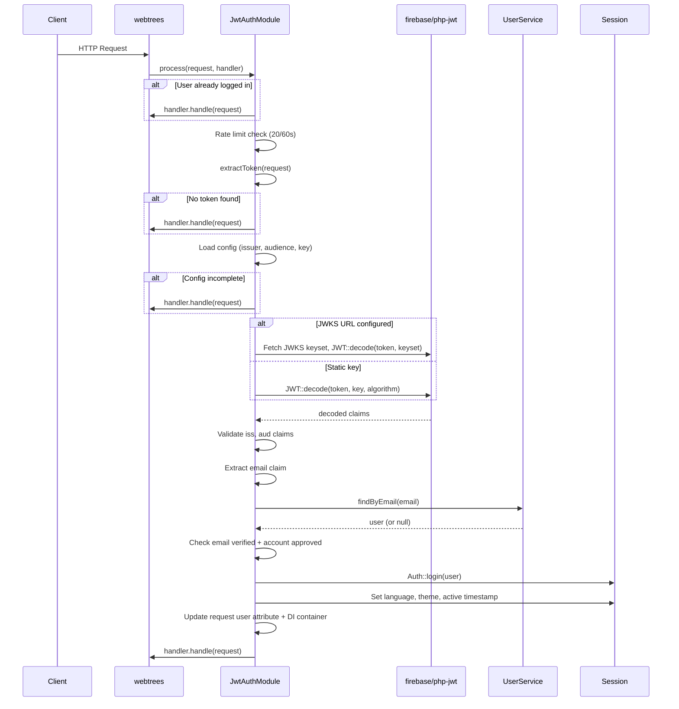
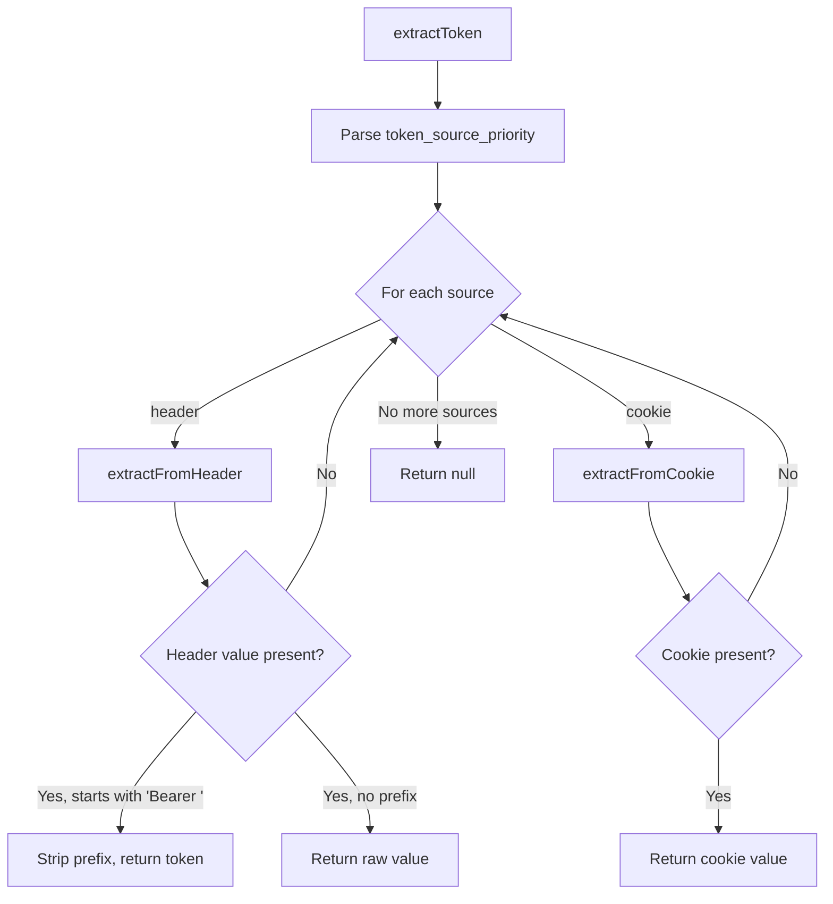

# Architecture

## Module Lifecycle

1. **Discovery:** webtrees `ModuleService` scans `modules_v4/*/module.php` and calls each file. `module.php` loads `vendor/autoload.php` (if present), requires `JwtAuthModule.php`, and returns a `JwtAuthModule` instance.
2. **Boot:** The `BootModules` middleware calls `boot()` on every discovered module. `JwtAuthModule::boot()` registers the `jwt-auth` view namespace and the admin config routes.
3. **Middleware:** On every request, webtrees calls `process()` on all modules implementing `MiddlewareInterface`. This is where JWT authentication happens.

## Middleware Flow



At every failure point, the module logs the reason via `Log::addAuthenticationLog()` and passes through to the next handler. It never blocks a request.

## Class Responsibilities

### JwtAuthModule

The main module class (`JwtAuthModule.php`). Extends `AbstractModule`, implements `ModuleCustomInterface`, `ModuleConfigInterface`, and `MiddlewareInterface`.

**Public methods:**
- `boot()` — registers view namespace and admin routes
- `title()` / `description()` — module metadata (translatable)
- `customModuleAuthorName()` / `customModuleVersion()` / `customModuleSupportUrl()` — custom module metadata
- `getConfigLink()` — returns the URL for the admin config page
- `process()` — PSR-15 middleware entry point

**Private/protected methods:**
- `extractToken()` — iterates over configured sources (`header`, `cookie`) in priority order
- `extractFromHeader()` — reads the configured header, strips `Bearer ` prefix if present
- `extractFromCookie()` — reads the configured cookie name
- `getConfig()` — resolves a config value from `config.ini.php` attributes first, then DB preferences
- `validateJwt()` — decodes token via static key or JWKS keyset, validates `iss` and `aud` claims
- `decodeWithJwks()` — decodes JWT using JWKS keyset; retries once on unknown `kid` (key rotation)
- `getJwksKeyset()` — returns cached JWKS keyset or fetches fresh
- `getCachedJwksKeyset()` — returns parsed keyset from cache if fresh (< 1 hour), null otherwise
- `fetchAndCacheJwks()` — fetches JWKS JSON from URL, parses, and stores in module preferences
- `fetchJwksJson()` — (protected) fetches raw JWKS JSON via HTTP; overridable in tests

### JwtConfigPage

GET handler for `/admin/modules/jwt-auth/config`. Reads all 8 module preferences (including `JWT_AUTH_JWKS_URL`) and passes them to the `jwt-auth::config` view using the admin layout.

### JwtConfigAction

POST handler for `/admin/modules/jwt-auth/config`. Validates the submitted form (JWKS URL must be HTTPS, algorithm allowlist, private key rejection, HS256 key length — algorithm/key validation is skipped when JWKS URL is set), builds `jwt_auth_source_priority` from checkbox inputs, clears JWKS cache if the URL changed, and saves all 8 preferences. Redirects back to `JwtConfigPage` with a flash message.

## Configuration Resolution

The module uses two configuration sources with defined precedence:

```
config.ini.php (highest priority)
       │
       ▼
Module preferences (DB, module_setting table)
```

Five settings support `config.ini.php` override via `getConfig()`:

| config.ini.php key | DB preference key |
|---|---|
| `jwt_auth_issuer` | `JWT_AUTH_ISSUER` |
| `jwt_auth_audience` | `JWT_AUTH_AUDIENCE` |
| `jwt_auth_jwks_url` | `JWT_AUTH_JWKS_URL` |
| `jwt_auth_header_name` | `JWT_AUTH_HEADER_NAME` |
| `jwt_auth_source_priority` | `JWT_AUTH_SOURCE_PRIORITY` |
| `jwt_auth_cookie_name` | `JWT_AUTH_COOKIE_NAME` |

Two settings are always DB-only:

| DB preference key | Default |
|---|---|
| `JWT_AUTH_PUBLIC_KEY` | (empty) |
| `JWT_AUTH_ALGORITHM` | `RS256` |

Two additional DB-only settings are managed internally (not user-configurable):

| DB preference key | Purpose |
|---|---|
| `JWT_AUTH_JWKS_CACHE` | Cached JWKS JSON response |
| `JWT_AUTH_JWKS_CACHE_TIMESTAMP` | Unix timestamp of last JWKS fetch |

## Token Extraction Pipeline



## JWT Validation

`validateJwt()` performs these checks:

1. **Key resolution** — if a JWKS URL is configured, the keyset is fetched (or loaded from cache). Otherwise, the static public key and algorithm from DB preferences are used.
2. **Signature verification** — `firebase/php-jwt` decodes the token using the resolved key(s). Invalid signatures, expired tokens (`exp`), and not-yet-valid tokens (`nbf`) cause exceptions.
3. **Issuer validation** — the `iss` claim must exactly match the configured issuer.
4. **Audience validation** — the `aud` claim (string or array) must contain the configured audience value.

The method does not validate `exp`/`nbf` directly — `firebase/php-jwt` handles that during `JWT::decode()`.

### JWKS Key Rotation

When using JWKS, `decodeWithJwks()` handles key rotation automatically:

1. Load the cached keyset (if fresh — less than 1 hour old).
2. Attempt to decode the token.
3. If decoding fails because the `kid` is unknown (key was rotated), refresh the cache from the JWKS URL and retry once.
4. If decoding fails due to an invalid signature, do not retry (the token is genuinely invalid).

## Error Handling

The module follows a "log and pass through" philosophy:

- If the module cannot authenticate the user for any reason, the request proceeds as if the module were not installed.
- All failures are logged to the webtrees authentication log with descriptive messages.
- No error responses, redirects, or HTTP status codes are generated by the module.
- Rate limit violations throw an exception from `RateLimitService`, which is caught by the general `catch (Exception)` block and logged.
